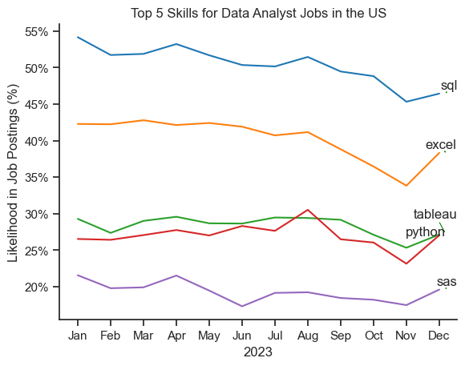
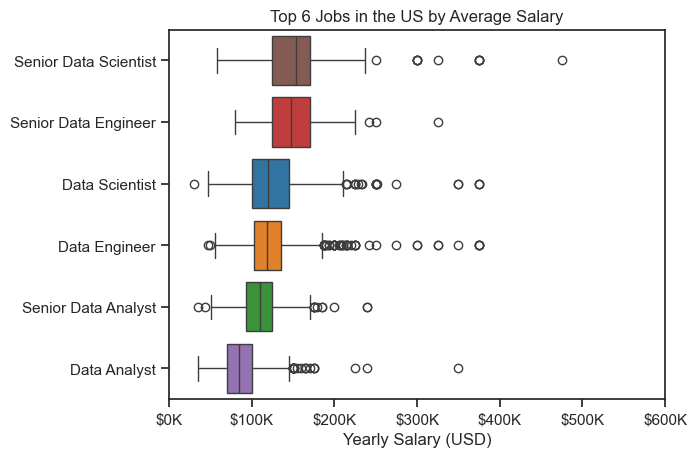
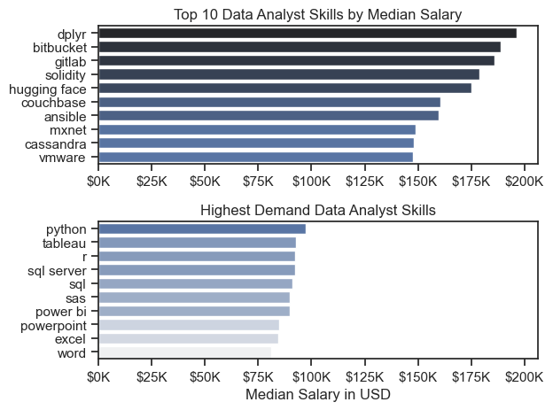
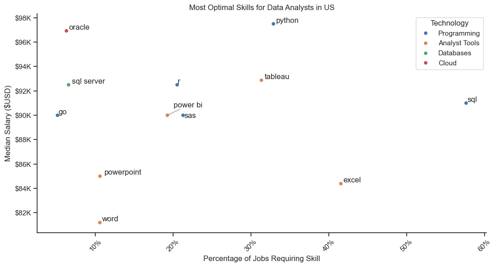

# Overview
Welcome to the analysis of the data job market, where i focusing on data analyst roles. This project was created out of a desire to navigate and understand the job market more effectively. It delves into the top-paying and in-demand skills to help find optimal job opportunities for data analysts.

The data sourced from [Luke Barousse's Python Course](https://www.lukebarousse.com/python) which provides a foundation for my analysis, containing detailed information on job topics. Through series of Python scripts, I explore key questions such as the most demanded skills, salary trends, and the intersection of demand and salary in data analytics.

# The Questions
Below are the questions that i wanted to answer in my project:

1. What are the skills most in demand for the top 3 most popular data roles?
2. How are in-demand skills trending for Data Analysts?
3. How well do jobs and skills pay for Data Analysts?
4. What are the optimal skills for data analysts to learn?

# Tolls I Used

- Python: The backbone of my analysis, allowing me to analyze and find critical insights, combined with the followings Python libraries:
    - Pandas Library: This was used to analyze the data.
    - Matplotlib Library: For visualizing the data.
    - Seaborn Library: To create more advanced visuals.
- Jupyter Notebooks: To run the Python scripts.
- Visual Studio Code: The IDE for executing the scripts.
- Git and Github: To control and share the Python code.

# The Analysis

## 1. What are the most demanded skills for the top 3 most popular data roles?

To find the most demanded skills for the top 3 most popular data roles. I filtered out those positions by which ones were the most popular, and got the top 5 skills for these top 3 roles. This query highlights the most popular job titles and their top skills, showing which skills i should pay attention to depending on the role I'm targeting.

View my notebook with detailed steps here:
[2_Skill_Demand.ipynb](3_Project/2_Skill_Count.ipynb)

```python
fig, ax = plt.subplots(len(job_titles), 1)

sns.set_theme(style="whitegrid")

for i, job_title in enumerate(job_titles):
    df_plot = df_skills_perc[df_skills_perc["job_title_short"] == job_title].head(5)
    sns.barplot(
        data=df_plot,
        x="skill_perc",
        y="job_skills",
        ax=ax[i],
        hue="skill_count",
        palette="dark:b_r",
        legend=False,
    )
    ax[i].set_title(job_title)
    ax[i].set_ylabel("")
    ax[i].set_xlabel("")
    ax[i].set_xlim(0, 78)
    
    for n, v in enumerate(df_plot["skill_perc"]):
        ax[i].text(v + 1, n, f"{v:.0f}%", va="center")
        
    if i != len(job_titles) - 1:    
        ax[i].set_xticks([])

fig.suptitle(
    "Likehood of Skill Being Required for Top 3 Job Titles in the US", fontsize=13
)
fig.tight_layout(h_pad=0.5)
plt.show()
```

### Results


### Insights

- SQL is the most in-demand skill across all three job titles. It has the highest likelihood of being required for all three positions (Data Analyst: 41%, Data Engineer: 68%, Data Scientist: 51%). This highlights the fundamental importance of SQL for data professions in general.

- Python is another highly sought-after skill. It's essential for Data Scientists (72%) and Data Engineers (65%), and also relevant for Data Analysts (27%). Python's versatility makes it a valuable tool for data manipulation, analysis, and machine learning.

- Skills required for Data Analysts and Data Scientists show some overlap. Both roles might require expertise in SQL, Python, and statistics (represented by SAS in the graph). However, Data Scientists tend to have a higher likelihood of needing these skills.

- Data Engineers and Data Scientists show the most overlap in skill requirements. Both roles heavily rely on Python and SQL, along with cloud platforms like AWS and Azure. However, Data Engineers have a higher likelihood of needing expertise in technologies like Spark for large-scale data processing.

## 2. How are in-demand skills trending for Data Analysts?

### Visualize Data

```python
df_plot = df_DA_US_perc.iloc[:, :5]

sns.lineplot(data=df_plot, dashes=False, palette="tab10")
sns.set_theme(style="ticks")
sns.despine()

plt.title("Top 5 Skills for Data Analyst Jobs in the US")
plt.ylabel("Likelihood in Job Postings (%)")
plt.xlabel("2023")
plt.legend().remove()

from matplotlib.ticker import PercentFormatter
ax = plt.gca()
ax.yaxis.set_major_formatter(PercentFormatter(decimals=0))

plt.show()
```

### Results

*Bar Graph visualizing the trending top skills for data analysts in the US in 2023.*

### Insights

- SQL consistently holds the top position as the most sought-after skill for Data Analysts throughout the year, with a relatively stable demand.

- Excel follows closely behind SQL, demonstrating consistent demand throughout the year. Its importance for data analysis and manipulation is evident.

- Both Tableau and Python exhibit fluctuations in demand throughout the year. While Python has seen a slight upward trend towards the end of the year, Tableau's demand has shown more variability.

- SAS, historically a staple in data analysis, has shown a declining trend in demand throughout the year. This suggests a potential shift towards more modern tools and programming languages.

## 3. How well do jobs and skills pay for Data Analysts?

### Salary Analysis 

#### Visualize Data

```python
sns.boxplot(
    data=df_US_top6,
    x="salary_year_avg",
    y="job_title_short",
    order=job_order,
    hue="job_title_short",
    dodge=False,
    palette="tab10",
)
sns.set_theme(style="ticks")

plt.title("Top 6 Jobs in the US by Average Salary")
plt.xlabel("Yearly Salary (USD)")
plt.ylabel("")
plt.xlim(0, 600_000)
ticks_X = plt.FuncFormatter(lambda y, _: f"${int(y/1000)}K")
plt.gca().xaxis.set_major_formatter(ticks_X)
plt.show()
```

#### Results



### Insights

- There's a considerable salary range across all job titles, indicating varying compensation levels within each role.

- As expected, Senior Data Scientist and Senior Data Engineer roles command the highest average salaries, with a wider salary range compared to their junior counterparts.

- There's some overlap in salary ranges between different job titles, suggesting potential salary variations based on factors other than job title, such as experience, location, company size, and specific skill set.

### Highest Paid and Most Demanded Skills for Data Analyst

#### Visualize Data

```python
sns.barplot(
    data=df_DA_top_pay,
    x="median",
    y=df_DA_top_pay.index,
    ax=ax[0],
    hue="median",
    palette="dark:b_r",
    legend=False,
)

sns.barplot(
    data=df_DA_skills,
    x="median",
    y=df_DA_top_pay.index,
    ax=ax[1],
    hue="median",
    palette="light:b",
    legend=False,
)

plt.show()
```

#### Results

*Two separate bar graphs visualizing the highest paid skills and most in-demand skills for data analysts in the US.*

#### Insights

- Skills like dplyr, bitbucket, gitlab, and solidity appear to command higher median salaries among Data Analysts. This suggests that proficiency in these tools or platforms can lead to higher compensation.

- There is a significant variation in median salaries among the top 10 skills. This indicates that the choice of skills can significantly impact earning potential.

- Python and Tableau are the most in-demand skills for Data Analysts, as evidenced by their position at the top of the chart.

- To maximize earning potential, Data Analysts should consider acquiring skills in tools like dplyr, bitbucket, and gitlab, while also mastering the highly demanded skills of Python and Tableau.

## 4. What is the most optimal skill to learn for Data Analysts?

### Visualize Data

```python
sns.scatterplot(
    data=df_plot,
    x="skill_perc",
    y="median_salary",
    hue="technology",
)

plt.tight_layout()
plt.show()
```

#### Results


*A scatter plot visualizing the most optimal skills (high paying and high demand) for data analysts in the US.*

#### Insights

- Skills like Python, SQL, and Tableau are positioned in the upper right quadrant, indicating high demand and high median salaries. These are considered the most valuable skills for Data Analysts.

- Skills like Excel, PowerPoint, and Word, while in high demand, are associated with lower median salaries. This suggests that while these skills are essential, they might not command as high a premium as technical skills like Python and SQL.

- Skills like Oracle and dplyr, though not as widely demanded, are associated with higher median salaries. This could indicate specialized roles or niche markets where these skills are highly valued.

- Skills like SAS and SAS are positioned in the lower left quadrant, suggesting lower demand and lower median salaries.

- It highlights the importance of technical skills like Python, SQL, and Tableau for career advancement and higher earnings. However, it also suggests that a combination of technical and soft skills, including proficiency in tools like Excel and PowerPoint, is essential for overall job success.

# What I Learned
Throughout this project, i deepened my understanding of data analyst job market and improve my technical skills in Python, especially in data manipulation and visualization, like:

- Advanced Python Usage: Utilizing libraries like Pandas for data manipulation, Seaborn and Matplotlib for data visualization, and other libraries helped me perform complex data analysis tasks more efficiently.
- Data Cleaning Importance: I learned that thorough data cleaning and preparation are crucal before any analysis.
- Strategic Skill Analysis: The project helped me to understand what are the skills with high market demand. Understanding the relationship between skill demand, salary and job availability.

# Challenges I Faced

- Data Inconsistencies: Handling missing or inconsistent data entries requires careful consideration and good techniques to ensure the integrity of the analysis.
- Complex Data Visualization: Designing effective visual representations of complex data was challenging, for clearly insights.
  
# Conclusions

My exploration into the data analyst job market has been so informative, highlighting the critical skills and trends that shape this evolving field. As the market continues to change, ongoing analysis will be essential to stay ahead in data analytics. This project is a good foundation for future explorations and underscores the importance of continuous learning and adaption in the data field.

